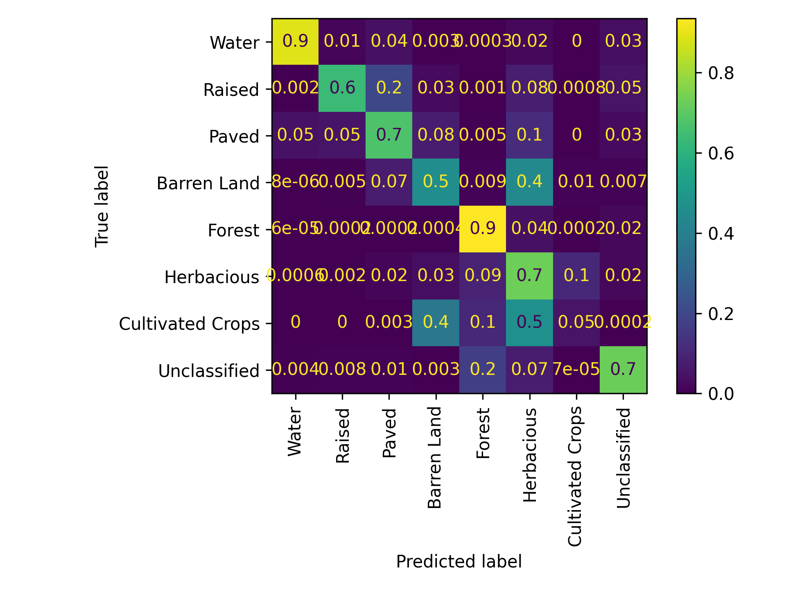

## About

This project uses a U-Net model to perform semantic segmentation on color infrared (CIR) imagery. The dataset belongs to the [Geospatial Computing for Environmental Research (GCER)](https://www.gcerlab.com/) lab at MSState. It contains `.tif` raster images with embedded geospatial metadata, making it ideal for environmental monitoring and land cover classification.

The dataset is organized into three subsets:

```
datasets/
├── test
├── train
└── val
```

### Model Architecture

U-Net is a popular CNN architecture designed for semantic segmentation tasks. Its symmetric encoder-decoder structure allows it to generate detailed segmentation masks, even with limited data. In this case, the model is trained on CIR imagery, which includes red, green, blue, and near-infrared bands. This helps improve the model’s ability to distinguish biophysical features (crops, forest, shrubs, water bodies, and so on) more accurately.

Known labels = `['Water', 'Raised Structures', 'Paved Structures', 'Barren Land', 'Forest', 'Herbacious', 'Cultivated Crops', 'Unclassified']`

### U-Net model architecture

The U-Net model simplified:
```
**Encoder (downsampling)**  
- One initial double conv layer:  (Conv2d → BatchNorm → ReLU) × 2  
- Four down blocks:  MaxPool → ((Conv2d → BatchNorm → ReLU) × 2)

**Bottleneck**  
- The last down block acts as the bottleneck

**Decoder (upsampling)**  
- Four up blocks:  ConvTranspose2d → pad → concat → ((Conv2d → BatchNorm → ReLU) × 2)

**Output**  
- 1×1 Conv2d layer
```

### Example data

- **Input**:
  

- **Ground truth label**:
  

### Training step

The model was trained on NVIDIA RTX4090 and training completed in under 30 mins using early stopping and a learning rate scheduler for efficient convergence.

- **Segmentation during training**:
  

- **Training metrics**:
  

- **Confusion Matrix**:
  

### Final Evaluation


Reference: [GCER](https://vsmartins.github.io/gcersat/docs/deeplearning/unet_class.html)
